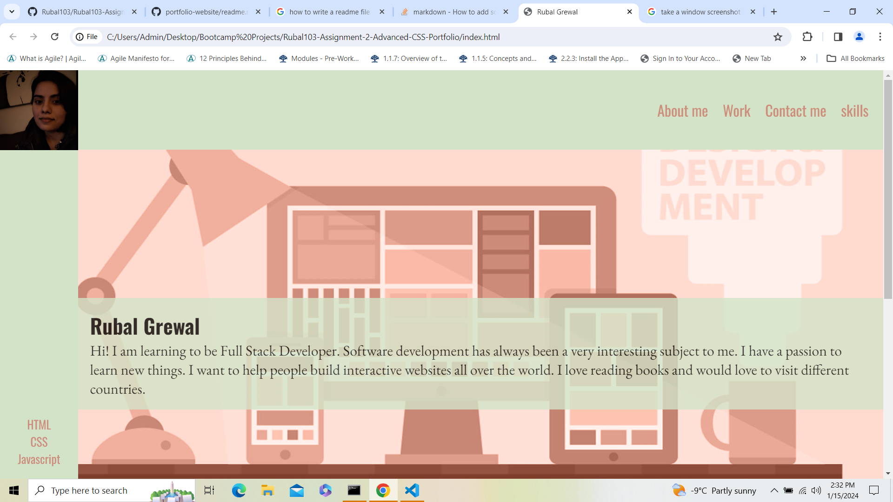
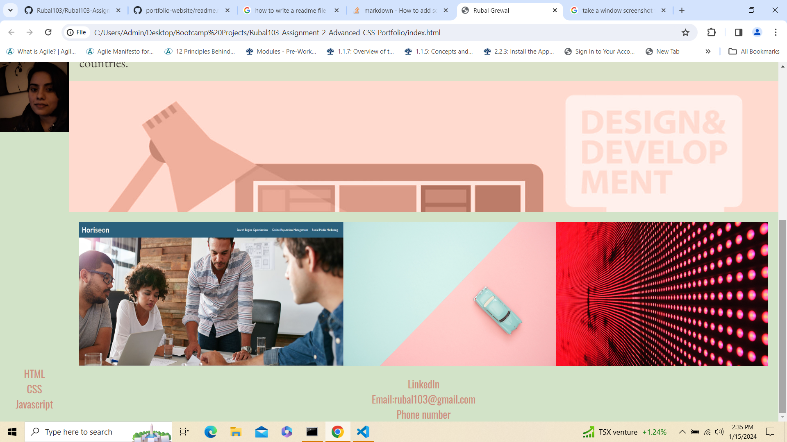
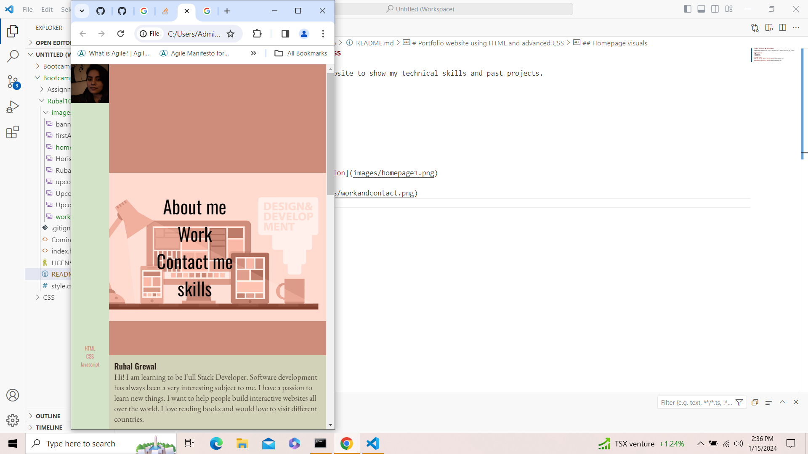
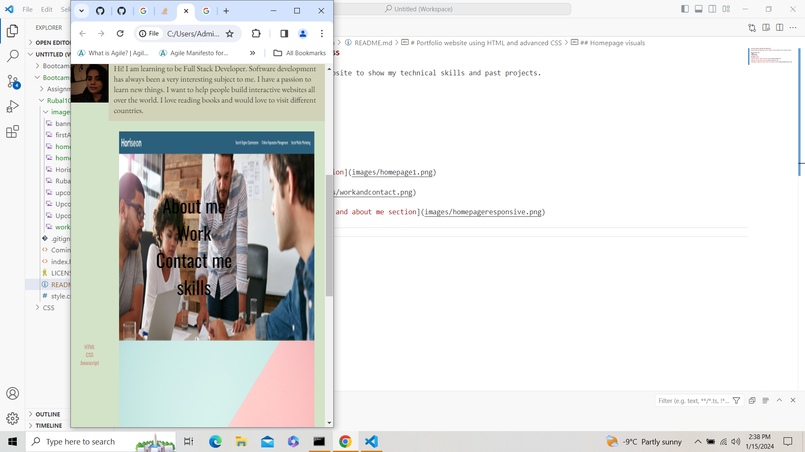
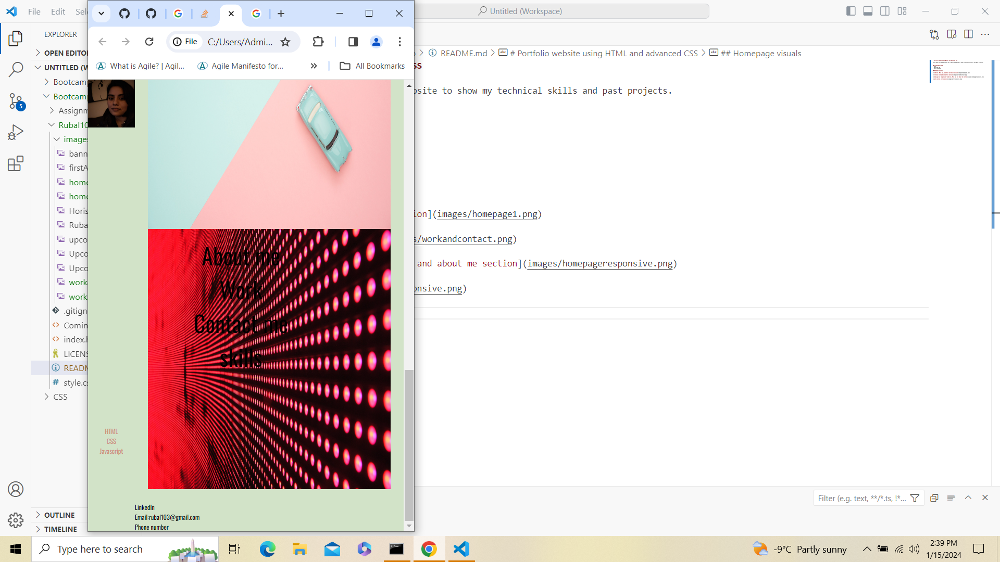

# Portfolio website using HTML and advanced CSS

Using both HTML and advanced CSS I built a website to show my technical skills and past projects. 

## Technologies used
* HTML
* Advanced CSS
* Stack overflow

## Homepage visuals

